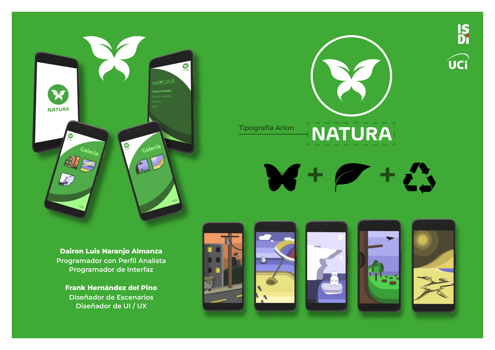

  <h1 align="center">NATURA</h1>
  

### NATURA es una aplicación de Quiz sobre la protección del medio ambiente creada con el motor de videojuegos Unity Engine.

  

  

### Requisites
- Unity ver. 2019.4.34f1 o superior.

## Authors

* **Dairon Luis Naranjo** - [Github](https://github.com/daironln/)
* **Frank Hdz del Pino** - [InstaGram](https://www.instagram.com/frank.hdezzz?igsh=MzRlODBiNWFlZA==)
